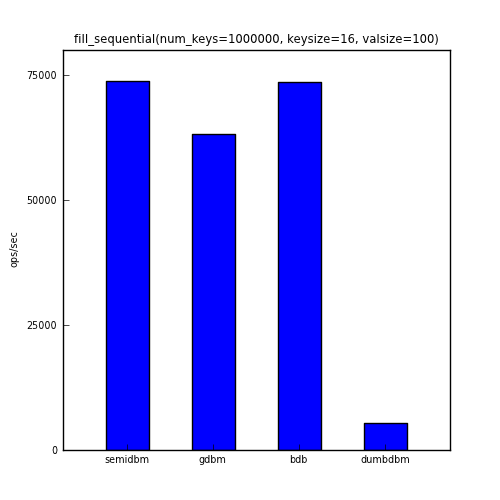
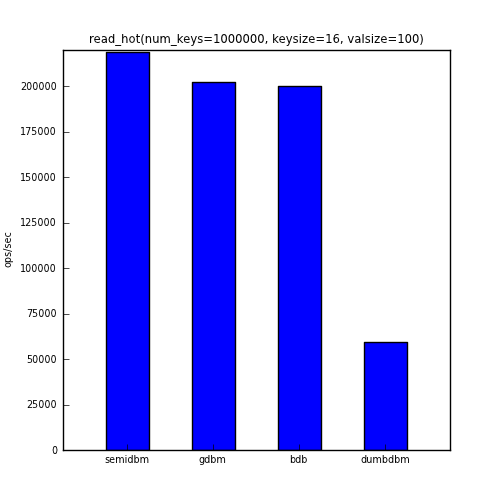
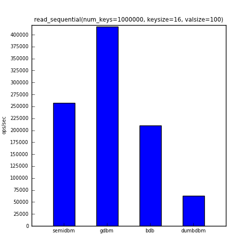
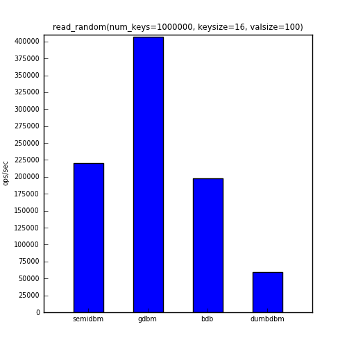
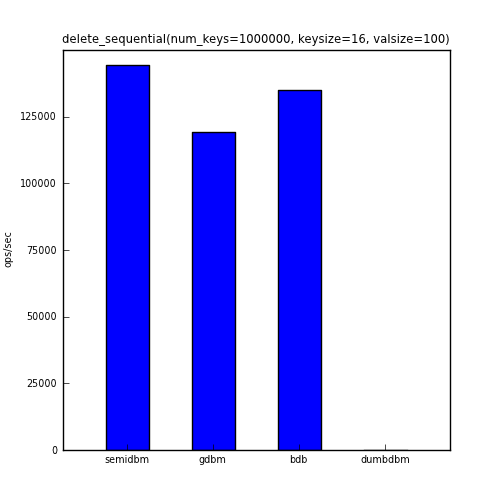
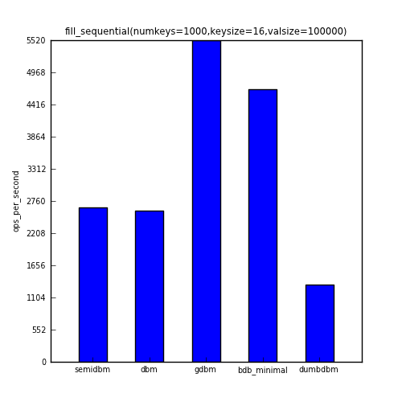
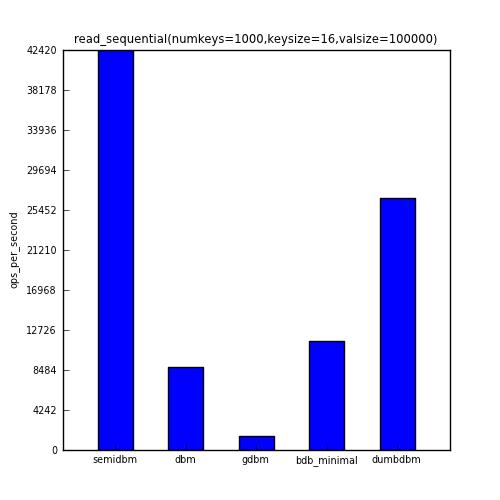
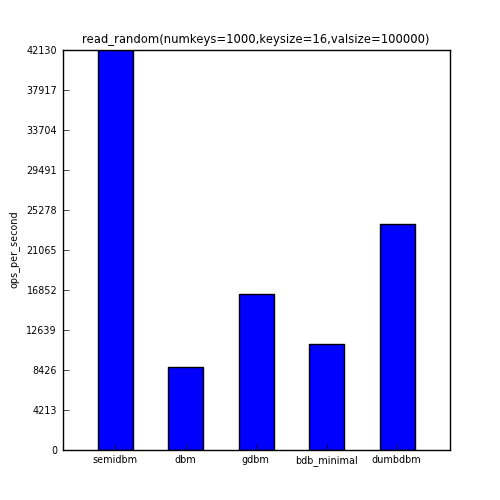
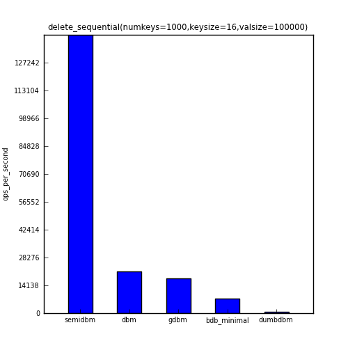

====================
Benchmarking Semidbm
====================

Semidbm was not written to be the fastest dbm available, but its performance is
surprisingly well for a pure python dbm.  Before showing the benchmark results,
it's important to note that these benchmark results can vary across machines
and should in no way be considered definitive nor comprehensive.  And yes,
there are other things besides performance that are important when considering
a dbm.

Benchmarking Approach
=====================

The benchmarks used for semidbm are based off the benchmark scripts for
`leveldb <http://code.google.com/p/leveldb/>`_. You can run the benchmark
scripts yourself using the `scripts/benchmark` script in the repo.  By default,
the benchmark uses a db of one million keys with 16 byte keys and 100 byte
values (these are the values used for leveldb's benchmarks).  All of these
parameters can be changed via command line arugments ( `-n`, `-k`, `-s`
respectively).

The benchmark script is written in a way to be compatible with any module
supporting the dbm interface.  Given the dbm interface isn't entirely
standardized, this is what is required:

* An `open()` function in the module (that behaves like `dumbdbm.open`,
  `gdbm.open`, etc).
* The returned object from `open()` is a "dbm" like object.  All the object
  needs to support is `__getitem__`, `__setitem__`, `__delitem__`, and
  `close()`.

To specify what dbm module to use, use the `-d` argument.  The value of this
argument should the module name of the dbm, for example, to run the benchmarks
against semidbm::

    scripts/benchmark -d semidbm

The `-d` argument can be specified multiple times.

If a dbm does not support a dbm interface, an adapter module can be written for
the dbm.  The directory `scripts/adapters` is added to `sys.path` before the
benchmarks are run, so benchmarking a 3rd party dbm is straightforward.  For
example, in order to benchmark Berkeley DB using the bsddb3 module, a
`scripts/adapters/bdb_minimal.py` file was created::

    import bsddb3.db
    def open(filename, mode):
        db = bsddb3.db.DB(None)
        if mode == 'r':
            flags = bsddb3.db.DB_RDONLY
        elif mode == 'rw':
            flags = 0
        elif mode == 'w':
            flags =  bsddb3.db.DB_CREATE
        elif mode == 'c':
            flags =  bsddb3.db.DB_CREATE
        elif mode == 'n':
            flags = bsddb3.db.DB_TRUNCATE | bsddb3.db.DB_CREATE
        else:
            raise bsddb3.db.DBError(
                "flags should be one of 'r', 'w', 'c' or 'n' or use the "
                "bsddb.db.DB_* flags")
        db.open(filename, None, bsddb3.db.DB_HASH, flags)
        return db

The `bsddb3.db.DB` object can now be benchmarked using::

    scripts/benchmark -d bdb_minimal

Benchmark Results
=================

Below are the results of benchmarking various dbms.
Although `scripts/benchmark` shows the results in various forms of measurement,
the measurement chosen here is the average number of operations per second over
the total number of keys.  For this measurement, **higher is better**.

The dbms chosen for this benchmark are:

* semidbm
* gdbm (GDN dbm)
* bdb (minimal Berkeley DB interface, `scripts/adapaters/bdb_minimal.py`)
* dumbdbm

The `dbm` module was not included because it was not able to add 1000000 to its
db, it raises an exception around 420000 keys with an "Out of overflow pages"
error.

This first benchmark shows the ops/sec for adding one million keys to the db.

The second benchmark shows the ops/sec for repeatedly accessing 1% of the keys
(randomly selected).

The next benchmark shows the ops/sec for reading all one million keys in the
same order that they were added.

The next benchmark shows the ops/sec for reading all one million keys in a
randomly selected order.

And the last benchmark shows the ops/sec for deleting all one million keys in
the same order that they were added.

Note that dumbdbm is not shown in the chart above.  This is because deletion of
keys in dumbdbm is extremely slow.  It also appears to have O(n) behavior (it
writes out its data file on every delete).  To give you an idea of the
performance, running this benchmark against dumbdbm with 1000 keys gave an
average ops/sec for the delete_sequential benchmark of **800**.  For 10000
keys dumbdbm resulted in **104** ops/sec.

The table below shows the actual numbers for the charts above.

+-------------------+-------------+------------+--------+---------+
|                   | semidbm     |  gdbm      |  bdb   | dumbdbm |
+===================+=============+============+========+=========+
| fill_sequential   |  **73810**  |  63177     |  73614 |    5460 |
+-------------------+-------------+------------+--------+---------+
| read_hot          |  **218651** | 202432     | 200111 |   59569 |
+-------------------+-------------+------------+--------+---------+
| read_sequential   |  257668     | **417320** | 209696 |   62605 |
+-------------------+-------------+------------+--------+---------+
| read_random       |  219962     | **406594** | 197690 |   59258 |
+-------------------+-------------+------------+--------+---------+
| delete_sequential |  **144265** | 119167     | 135137 |       0 |
+-------------------+-------------+------------+--------+---------+

Benchmarking With Large Values
------------------------------

One area where semidbm benchmarks really well is when dealing with large
values.  The same 5 benchmarks were repeated, but with only 1000 total keys,
16 byte keys, and 100000 byte values.

The first benchmark shows the ops/sec for 1000 sequential writes.

The second benchmark shows the ops/sec for repeatedly accessing 1% of the keys
(randomly selected).

.. image:: img/large_read_hot.png

The third benchmark shows the ops/sec for sequentially reading all 1000 keys.

The fourth benchmark shows the ops/sec for reading all 1000 keys in a
randomly selected order.

And the last benchmark shows the ops/sec for deleting all 1000 keys in
the same order that they were added.

Below is the raw data used to generate the above charts.

+----------------------+------------+-----------+-----------+-------------+-----------+
| n=1000,k=16,v=100000 |  semidbm   |    dbm    |   gdbm    | bdb_minimal |  dumbdbm  |
+======================+============+===========+===========+=============+===========+
| fill_sequential      |   2653     |  2591     |  **5525** |    4677     |  1330     |
+----------------------+------------+-----------+-----------+-------------+-----------+
| read_hot             |  **61016** |  8363     | 23104     |   11782     | 31624     |
+----------------------+------------+-----------+-----------+-------------+-----------+
| read_sequential      |  **42421** |  8822     |  1508     |   11519     | 26757     |
+----------------------+------------+-----------+-----------+-------------+-----------+
| read_random          |  **42133** |  8720     | 16442     |   11162     | 23778     |
+----------------------+------------+-----------+-----------+-------------+-----------+
| delete_sequential    | **141379** | 21167     | 17695     |    7267     |   780     |
+----------------------+------------+-----------+-----------+-------------+-----------+

You can see that with the exception of fill_sequential (in which the fastest
module, gdbm, was roughly twice as fast as semidbm), semidbm completely
outperforms all the other dbms.  In the case of read_sequential, semidbm's **28
times faster than gdbm.**

Overall, semidbm's performance is comparable to the performance of other dbms
with small keys and values, but is surprisingly faster than other dbms when
using large values.  It's also clear that semidbm is faster than dumbdbm is all
of the benchmarks shown here.

Running the Benchmarks
----------------------

You are encouraged to run the benchmarks yourself, to recreate the benchmark
above, you can run::

    scripts/benchmark -d semidbm -d gdbm -d bdb_minimal -d dumbdbm

Though keep in mind that you will probably want to stop the benchmark
once dumbdbm reaches the delete_sequential benchmark.  Either that or you can
leave off dumbdbm and run it with a smaller number of keys::

    scripts/benchmark -d dumbdbm -n 10000
